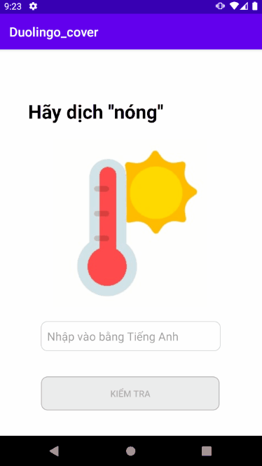
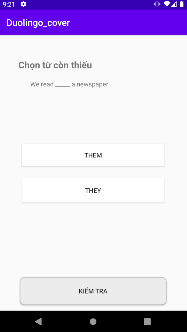
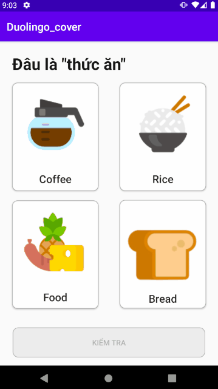

# NgoQuangHuy 

[Beginning Layout file](https://github.com/huyanngo/ELT3097-1-2020/blob/master/23/Duolingo/app/src/main/java/com/example/duolingo_cover/MainActivity.java)

[XML Layout Begining](https://github.com/huyanngo/ELT3097-1-2020/blob/master/23/Duolingo/app/src/main/res/layout/activity_main.xml)

[Choose Correct Answer file](https://github.com/huyanngo/ELT3097-1-2020/blob/master/23/Duolingo/app/src/main/java/com/example/duolingo_cover/ChooseCorrectAnswer.java)

[XML Correct Answer](https://github.com/huyanngo/ELT3097-1-2020/blob/master/23/Duolingo/app/src/main/res/layout/xml_choose_corect.xml)

[Vocabulary file](https://github.com/huyanngo/ELT3097-1-2020/blob/master/23/Duolingo/app/src/main/java/com/example/duolingo_cover/Vocabulary.java)

[XML Vocabulary](https://github.com/huyanngo/ELT3097-1-2020/blob/master/23/Duolingo/app/src/main/res/layout/xml_vocab.xml)

# NguyenVietHuyKhoi 

[Choose Vocabulary file](https://github.com/huyanngo/ELT3097-1-2020/blob/master/23/Duolingo/app/src/main/java/com/example/duolingo_cover/ChooseThemOrThey.java)

[Choose Image file](https://github.com/huyanngo/ELT3097-1-2020/blob/master/23/Duolingo/app/src/main/java/com/example/duolingo_cover/ChooseImage.java)

[XML Choose Them or They](https://github.com/huyanngo/ELT3097-1-2020/blob/master/23/Duolingo/app/src/main/res/layout/xml_them_or_they.xml)

[XML Choose Image file](https://github.com/huyanngo/ELT3097-1-2020/blob/master/23/Duolingo/app/src/main/res/layout/xml_choose_image.xml)
